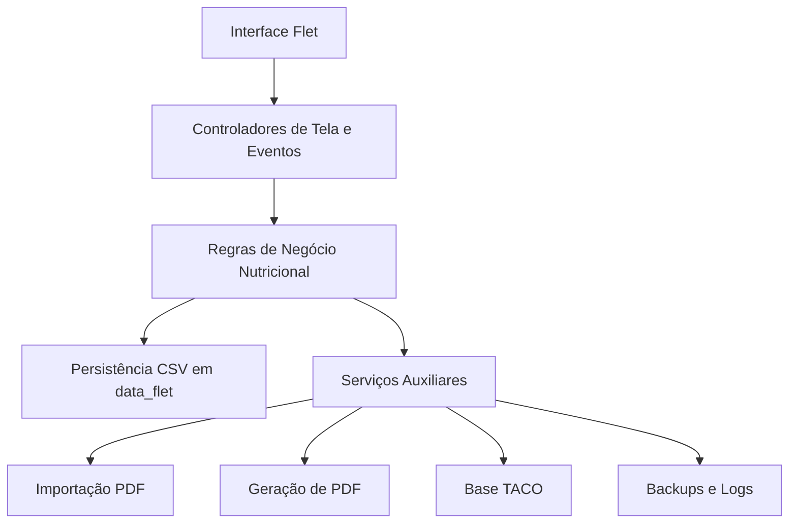
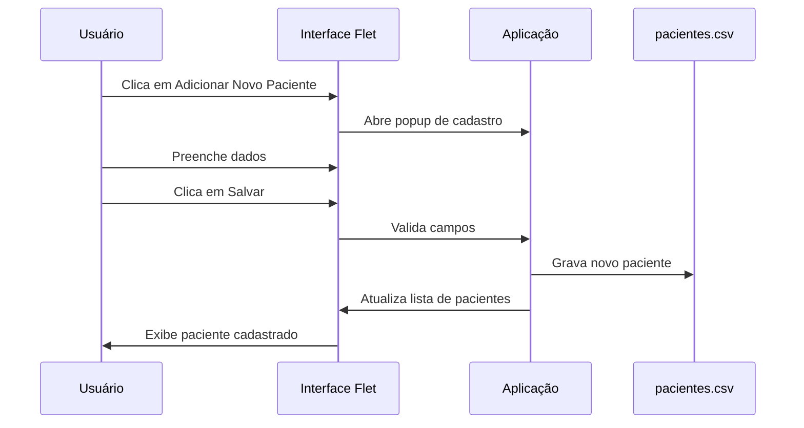
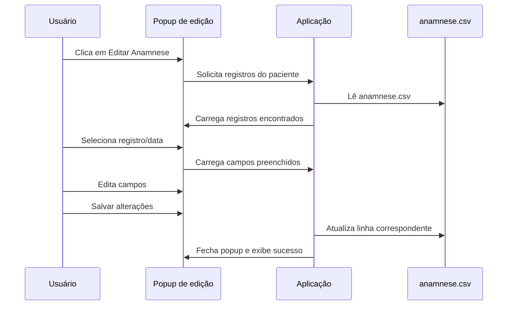
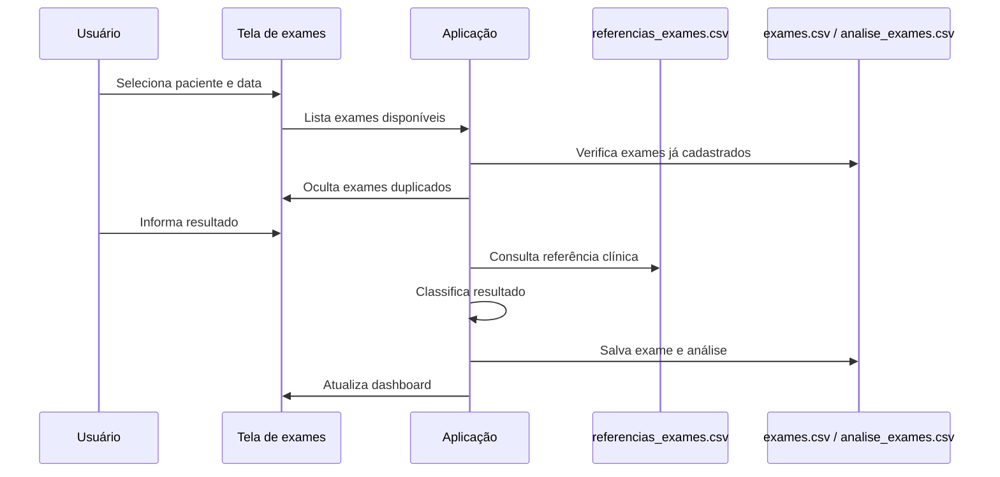
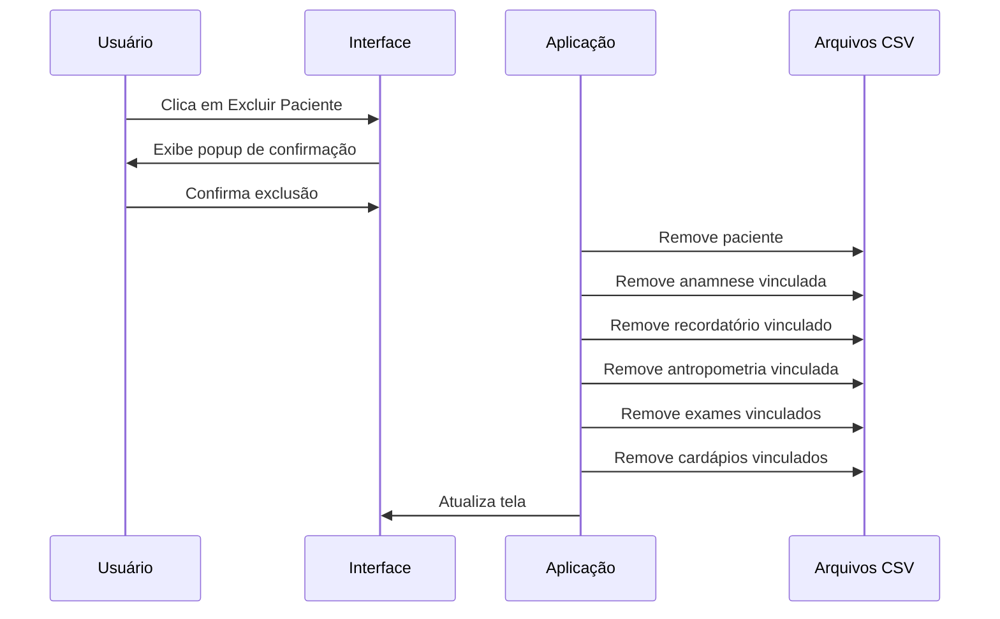

# NutriSoft — Documentação de Arquitetura e Engenharia de Software

## 1. Visão Geral

O **NutriSoft** é uma aplicação local de apoio ao atendimento nutricional clínico, desenvolvida em **Python** com interface gráfica em **Flet**. A aplicação tem como objetivo centralizar o cadastro de pacientes, anamnese, recordatório alimentar, avaliação antropométrica, exames laboratoriais, análise clínica, geração de cardápios, comparação nutricional e emissão de relatórios em PDF.

A solução foi concebida inicialmente para uso **desktop local**, com suporte para Windows e Linux, e posteriormente recebeu uma estrutura inicial para execução em **tablet Android**, mantendo a mesma lógica de negócio e adaptando a persistência para o armazenamento interno persistente do aplicativo.

O NutriSoft opera com persistência em arquivos CSV, organizados na pasta `data_flet`, dispensando o uso inicial de banco de dados relacional. Essa decisão favorece simplicidade operacional, portabilidade, backup direto, facilidade de auditoria e independência de serviços externos.

---

## 2. Objetivos da Aplicação

### 2.1 Objetivo Principal

Oferecer uma ferramenta simples, local e funcional para acompanhamento nutricional, permitindo que a nutricionista registre, consulte, edite e analise dados clínicos e nutricionais dos pacientes.

### 2.2 Objetivos Específicos

* Cadastrar pacientes.
* Registrar e editar anamnese nutricional.
* Registrar e editar recordatório habitual.
* Registrar e editar ficha antropométrica.
* Importar e analisar exames laboratoriais.
* Manter base de referências clínicas para exames.
* Identificar exames alterados, normais e críticos.
* Gerar dashboard clínico do paciente.
* Utilizar base alimentar TACO.
* Gerar cardápio nutricional.
* Comparar recomendado nutricional versus cardápio planejado.
* Exportar relatórios clínicos em PDF.
* Manter dados localmente, com possibilidade de backup e transporte.
* Disponibilizar versão desktop e base inicial para tablet Android.

---

## 3. Escopo Funcional

### 3.1 Cadastro de Pacientes

A aplicação permite o cadastro de pacientes com dados básicos, identificação interna e informações utilizadas nos demais módulos. Cada paciente recebe um identificador único, utilizado como chave de relacionamento entre os arquivos CSV.

Principais operações:

* Listar pacientes cadastrados.
* Adicionar novo paciente.
* Selecionar paciente ativo.
* Excluir paciente e todos os registros relacionados.
* Atualizar lista de pacientes após cadastro ou exclusão.

### 3.2 Anamnese Nutricional

O módulo de anamnese permite registrar dados clínicos, comportamentais e nutricionais do paciente.

A anamnese contempla informações como:

* Queixa principal.
* História da doença atual.
* Sintomas.
* História patológica pregressa.
* História familiar.
* Atividade física.
* Consumo de álcool.
* Tabagismo.
* Sono.
* Funcionamento intestinal e urinário.
* Medicamentos e suplementos.
* Intolerâncias e alergias alimentares.
* Objetivos nutricionais.
* Preferências e aversões alimentares.
* Dificuldades de adesão.

O sistema também possui edição da anamnese já cadastrada, com campos carregados em popup e seleção guiada por listas suspensas e múltiplas seleções.

### 3.3 Recordatório Habitual

O módulo de recordatório registra o padrão alimentar habitual do paciente, organizado por refeições.

Refeições previstas:

* Desjejum.
* Lanche da manhã.
* Almoço.
* Lanche da tarde.
* Jantar.
* Ceia.
* Observações.

Na edição, o sistema possui montador guiado de refeição, permitindo selecionar alimentos, bebidas e características da refeição.

### 3.4 Antropometria

O módulo de antropometria registra dados físicos e medidas corporais do paciente.

Campos principais:

* Data da avaliação.
* Tipo de avaliação.
* Objetivo antropométrico.
* Condição da medição.
* Tipo de balança.
* Roupa usada na medição.
* Peso.
* Altura.
* Circunferência da cintura.
* IMC.
* Classificação do IMC.
* Risco pela cintura.
* Observações.

O sistema recalcula automaticamente o IMC e o risco relacionado à circunferência da cintura ao salvar alterações na ficha antropométrica.

### 3.5 Exames Laboratoriais

O NutriSoft permite cadastrar exames manualmente e importar exames a partir de arquivos PDF laboratoriais.

Funcionalidades implementadas:

* Cadastro manual de exames.
* Importação de PDF Fleury.
* Associação do exame ao paciente.
* Controle de exames por data.
* Identificação de exames já cadastrados para evitar duplicidade.
* Lista suspensa dinâmica para não exibir exame já cadastrado na mesma data.
* Classificação dos exames como normal, baixo, alto, alterado ou crítico.
* Base de referências clínicas por exame.
* Alias de exames para padronizar nomes importados.

### 3.6 Dashboard Clínico

O dashboard apresenta visão consolidada do estado clínico e nutricional do paciente, incluindo:

* Quantidade total de exames.
* Exames normais.
* Exames em atenção.
* Exames críticos.
* Indicadores antropométricos.
* Resumo clínico nutricional.
* Alertas baseados em exames e medidas.

### 3.7 Cardápio Nutricional

O sistema possui módulo de cardápio com uso de base alimentar TACO.

Funcionalidades:

* Base de alimentos com dados nutricionais.
* Criação de cardápio por refeições.
* Edição do cardápio.
* Comparação entre recomendado e planejado.
* Exportação do cardápio em PDF.
* Histórico de cardápios.

### 3.8 Relatórios PDF

A aplicação gera relatórios clínicos e nutricionais em PDF.

Relatórios contemplam:

* Identificação do paciente.
* Dados antropométricos.
* Exames analisados.
* Exames alterados.
* Síntese clínica.
* Recomendações nutricionais.
* Cardápio quando aplicável.

---

## 4. Arquitetura de Software

## 4.1 Estilo Arquitetural

O NutriSoft segue uma arquitetura de **monólito local modular**, orientada a eventos de interface gráfica.

A aplicação é monolítica porque todo o fluxo principal está concentrado em uma única aplicação Python, sem separação em backend remoto, API externa ou banco de dados centralizado.

Apesar disso, a aplicação possui separação lógica entre:

* Interface.
* Regras de negócio.
* Persistência em arquivos.
* Importação de dados.
* Geração de relatórios.
* Utilitários clínicos.
* Empacotamento desktop e mobile.

Essa abordagem foi escolhida para simplificar instalação, reduzir dependências externas e permitir uso offline.

---

## 4.2 Visão em Camadas

A arquitetura pode ser representada em cinco camadas principais:



### Camada 1 — Interface

Responsável pela apresentação visual e interação com o usuário.

Tecnologia:

* Flet.
* Componentes visuais como `Page`, `Container`, `Column`, `Row`, `Dropdown`, `TextField`, `AlertDialog`, `ElevatedButton`, `TextButton`.

Responsabilidades:

* Renderizar telas.
* Exibir popups.
* Capturar cliques e alterações de campos.
* Atualizar visualmente listas e dashboards.
* Exibir mensagens de erro ou sucesso.

### Camada 2 — Controladores de Tela e Eventos

Responsável por conectar ações da interface à lógica da aplicação.

Exemplos:

* Clique em “Adicionar Novo Paciente”.
* Clique em “Editar Anamnese”.
* Seleção de paciente.
* Salvamento de formulário.
* Exclusão de paciente.
* Exportação de PDF.

Responsabilidades:

* Coletar dados dos campos.
* Validar entradas.
* Chamar funções de persistência.
* Atualizar telas.
* Abrir e fechar diálogos.
* Recarregar dados em memória.

### Camada 3 — Regras de Negócio

Responsável pelas regras clínicas e operacionais.

Exemplos:

* Calcular IMC.
* Classificar IMC.
* Classificar risco por circunferência da cintura.
* Identificar exames alterados.
* Evitar duplicidade de exames na mesma data.
* Associar registros ao paciente correto.
* Interpretar referências laboratoriais.
* Comparar cardápio planejado com necessidades nutricionais.

### Camada 4 — Persistência

Responsável por leitura e escrita dos dados em CSV.

Diretório principal:

```text
data_flet/
```

Arquivos principais:

```text
pacientes.csv
anamnese.csv
recordatorio_habitual.csv
antropometria.csv
exames.csv
referencias_exames.csv
alias_exames.csv
analise_exames.csv
historico_edicoes.csv
evolucao_conduta.csv
preferencias_inicio.csv
taco_alimentos.csv
cardapios.csv
cardapio_itens.csv
```

A persistência em CSV permite:

* Simplicidade.
* Portabilidade.
* Leitura manual.
* Backup direto.
* Baixa complexidade de implantação.

### Camada 5 — Serviços Auxiliares

Inclui recursos complementares:

* Importadores de PDF.
* Geradores de relatório.
* Cálculos clínicos.
* Exportação de cardápio.
* Scripts utilitários.
* Empacotamento Windows.
* Estrutura Android/tablet.
* Rotinas de backup.

---

## 5. Arquitetura Física

### 5.1 Estrutura Local Desktop

Estrutura simplificada da aplicação desktop:

```text
nutrisoft/
├── nutrisoft_flet_app.py
├── data_flet/
├── scripts/
├── relatorios/
├── backups/
├── logs/
├── dist_windows/
├── dist_android/
├── backups_final/
├── README.md
└── .gitignore
```

### 5.2 Estrutura Windows

O pacote Windows direto contém:

```text
NutriSoft_Direto_Windows/
├── nutrisoft_flet_app.py
├── data_flet/
├── scripts/
├── relatorios/
├── backups/
├── logs/
├── nutrisoft_icon.ico
├── 01_INSTALAR_BIBLIOTECAS.bat
├── INICIAR_NUTRISOFT.bat
├── INICIAR_PELO_ARQUIVO_PY.bat
├── BACKUP_DADOS.bat
└── LEIA-ME.txt
```

A execução é feita diretamente pelo Python instalado no Windows, evitando instalador complexo.

### 5.3 Estrutura Android Tablet

A versão tablet Android usa estrutura separada:

```text
dist_android/NutriSoft_Tablet_Android/
├── main.py
├── data_flet/
├── scripts/
├── relatorios/
├── backups/
├── assets/
├── pyproject.toml
├── build_apk_tablet.sh
├── build_aab_tablet.sh
└── instalar_tablet_adb.sh
```

No Android, os dados não devem ser gravados diretamente na pasta interna do APK. Por isso, foi criada lógica para usar armazenamento persistente do app via variável `FLET_APP_STORAGE_DATA`.

---

## 6. Modelo de Dados

## 6.1 Estratégia Geral

O modelo de dados é baseado em arquivos CSV relacionados por `paciente_id`.

O `paciente_id` atua como chave lógica entre:

* Pacientes.
* Anamnese.
* Recordatório.
* Antropometria.
* Exames.
* Cardápios.
* Evoluções.

### 6.2 Entidade Paciente

Arquivo:

```text
data_flet/pacientes.csv
```

Responsabilidade:

* Armazenar dados cadastrais do paciente.
* Fornecer chave para todos os demais registros.

Relacionamentos:

```text
pacientes.paciente_id 1:N anamnese.paciente_id
pacientes.paciente_id 1:N recordatorio_habitual.paciente_id
pacientes.paciente_id 1:N antropometria.paciente_id
pacientes.paciente_id 1:N exames.paciente_id
pacientes.paciente_id 1:N cardapios.paciente_id
```

### 6.3 Entidade Anamnese

Arquivo:

```text
data_flet/anamnese.csv
```

Contém informações clínicas e comportamentais do paciente.

Uma anamnese pertence a um paciente e é identificada por data.

### 6.4 Entidade Recordatório

Arquivo:

```text
data_flet/recordatorio_habitual.csv
```

Contém o padrão alimentar habitual do paciente.

Cada registro pertence a um paciente e possui data de registro.

### 6.5 Entidade Antropometria

Arquivo:

```text
data_flet/antropometria.csv
```

Contém medidas antropométricas e indicadores calculados.

Campos calculados:

* IMC.
* Classificação do IMC.
* Risco pela cintura.

### 6.6 Entidade Exames

Arquivos relacionados:

```text
exames.csv
analise_exames.csv
referencias_exames.csv
alias_exames.csv
```

Responsabilidades:

* Armazenar resultados laboratoriais.
* Padronizar nomes de exames.
* Aplicar referências clínicas.
* Classificar alterações.
* Apoiar o dashboard clínico.

### 6.7 Entidade Cardápio

Arquivos:

```text
cardapios.csv
cardapio_itens.csv
taco_alimentos.csv
```

Responsabilidades:

* Armazenar cardápios.
* Relacionar refeições e alimentos.
* Utilizar base TACO para cálculo nutricional.
* Comparar planejamento alimentar com recomendação.

---

## 7. Fluxos Principais

## 7.1 Fluxo de Cadastro de Paciente



## 7.2 Fluxo de Edição de Anamnese



## 7.3 Fluxo de Cadastro e Análise de Exames



## 7.4 Fluxo de Exclusão de Paciente



---

## 8. Decisões Arquiteturais

## 8.1 Uso de Flet

O Flet foi escolhido por permitir construção rápida de interface gráfica em Python com possibilidade de distribuição para desktop, web e mobile.

Vantagens:

* Desenvolvimento rápido.
* Interface moderna.
* Código Python puro.
* Possibilidade de empacotamento desktop e Android.
* Boa integração com componentes visuais.

Limitações observadas:

* Alguns componentes não estavam disponíveis ou apresentaram restrições na versão utilizada.
* `FilePicker` apresentou incompatibilidade no ambiente atual.
* `WebView` não foi utilizado.
* Alguns métodos modernos de diálogo não estavam compatíveis.
* Popups grandes precisam de ajuste para tablet/celular.

## 8.2 Uso de CSV como Persistência

O CSV foi escolhido por simplicidade operacional.

Vantagens:

* Fácil backup.
* Fácil inspeção.
* Não exige servidor.
* Não exige instalação de banco.
* Adequado para uso local individual ou pequeno volume.

Limitações:

* Menor controle transacional.
* Maior cuidado com concorrência.
* Validações precisam ser feitas pela aplicação.
* Crescimento futuro pode exigir migração para SQLite ou PostgreSQL.

## 8.3 Aplicação Local

A aplicação foi projetada para funcionar localmente, sem depender de internet.

Vantagens:

* Maior controle sobre dados.
* Menor dependência externa.
* Simplicidade de implantação.
* Melhor aderência a consultórios pequenos.

Riscos:

* Backup depende do usuário.
* Dados ficam no dispositivo.
* Segurança depende do ambiente local.
* Multiusuário não é suportado nativamente.

## 8.4 Separação Desktop e Tablet

A versão desktop é a versão principal.

A versão tablet foi criada como uma ramificação estrutural, adaptando principalmente:

* Caminho de armazenamento.
* Empacotamento Android.
* Nome da aplicação.
* Estrutura de build APK/AAB.

A lógica funcional permanece compartilhada.

---

## 9. Engenharia de Software

## 9.1 Organização do Código

O arquivo principal atual é:

```text
nutrisoft_flet_app.py
```

Ele concentra:

* Inicialização da aplicação.
* Definição das telas.
* Funções de leitura e escrita CSV.
* Componentes de interface.
* Regras clínicas.
* Popups.
* Módulos de edição.
* Exportação de relatórios.
* Integrações auxiliares.

Scripts auxiliares ficam em:

```text
scripts/
```

Exemplo:

```text
scripts/importar_fleury_pdf.py
```

## 9.2 Estratégia de Evolução

Durante o desenvolvimento foram aplicados patches incrementais, sempre com backup do arquivo principal antes das alterações.

Padrão utilizado:

```bash
cp nutrisoft_flet_app.py nutrisoft_flet_app_backup_nome_do_patch_$(date +%Y%m%d_%H%M%S).py
```

Essa estratégia reduz risco de perda de versão funcional e facilita rollback manual.

## 9.3 Validação Sintática

Após cada alteração relevante, o código é validado com:

```bash
python3 -m py_compile nutrisoft_flet_app.py
```

Essa validação garante que não há erro sintático antes da execução.

## 9.4 Backup

O projeto possui rotina de backup final contendo:

* Código principal.
* Base `data_flet`.
* Scripts.
* Relatórios.
* Pacotes Windows.
* Estrutura Android.
* Logs.
* Backups anteriores.

Backups finais são armazenados em:

```text
backups_final/
```

## 9.5 Versionamento Git

Para subir o projeto ao GitHub com segurança, devem ser versionados apenas arquivos sem dados sensíveis.

Arquivos recomendados para versionamento:

```text
nutrisoft_flet_app.py
scripts/
data_flet_modelo/
README.md
.gitignore
docs/
```

Arquivos que não devem ser versionados:

```text
data_flet/
relatorios/
backups/
backups_final/
logs/
dist_windows/
dist_android/
*.pdf
*.zip
*.tar.gz
*.apk
*.aab
```

Essa decisão reduz risco de exposição de dados clínicos e pessoais.

---

## 10. Requisitos Não Funcionais

## 10.1 Portabilidade

A aplicação deve rodar em:

* Linux Ubuntu.
* Windows com Python instalado.
* Tablet Android após build APK.

## 10.2 Operação Offline

A aplicação deve funcionar sem internet para:

* Cadastro.
* Edição.
* Consulta.
* Geração de PDF.
* Uso da base TACO.
* Análise de dados já cadastrados.

## 10.3 Segurança e Privacidade

Como o NutriSoft manipula dados clínicos e pessoais, recomenda-se:

* Não subir dados reais ao GitHub.
* Usar repositório privado.
* Realizar backup criptografado em mídia externa.
* Proteger o computador/tablet com senha.
* Evitar compartilhamento de PDFs clínicos por meios inseguros.
* Manter controle sobre arquivos exportados.
* Implementar autenticação local em versão futura.

## 10.4 Usabilidade

A aplicação prioriza:

* Interface visual com cards.
* Popups de cadastro e edição.
* Botões claros.
* Navegação por seções.
* Indicação da página ativa.
* Listas suspensas para reduzir erro de digitação.
* Seleções múltiplas em campos clínicos recorrentes.

## 10.5 Manutenibilidade

A manutenibilidade atual é aceitável para fase inicial, mas há oportunidades de melhoria:

* Modularizar o arquivo principal.
* Separar telas em arquivos próprios.
* Criar camada formal de repositórios CSV.
* Criar camada formal de serviços clínicos.
* Criar testes automatizados.
* Criar migração futura para SQLite.

## 10.6 Desempenho

Como a base é local e pequena, o uso de CSV é suficiente.

Pontos de atenção futuros:

* Crescimento da quantidade de pacientes.
* Crescimento dos exames.
* Geração de relatórios extensos.
* Manipulação de PDFs grandes.
* Uso em tablet com hardware limitado.

---

## 11. Tratamento de Erros

A aplicação utiliza tratamento de exceções em pontos críticos, como:

* Leitura de CSV.
* Escrita de CSV.
* Atualização de listas.
* Salvamento de formulário.
* Recarregamento de dados em memória.
* Importação de PDF.
* Geração de relatórios.

Quando possível, o erro é exibido ao usuário por mensagem visual. Em outros casos, o erro é impresso no terminal para diagnóstico.

Melhoria futura recomendada:

* Criar logger centralizado.
* Persistir logs técnicos em `logs/`.
* Criar tela de diagnóstico do sistema.
* Criar validador da integridade dos CSVs.

---

## 12. Estratégia de Build e Distribuição

## 12.1 Linux

Execução direta:

```bash
cd ~/projetos/nutrisoft
python3 nutrisoft_flet_app.py
```

## 12.2 Windows

Estratégia adotada:

* Rodar diretamente pelo `.py`.
* Instalar bibliotecas por `.bat`.
* Evitar instalador complexo.
* Evitar runtime interno.
* Evitar dependência de diretórios restritos do usuário.

Execução:

```bat
INICIAR_NUTRISOFT.bat
```

## 12.3 Android Tablet

Estratégia:

* Criar projeto separado em `dist_android/NutriSoft_Tablet_Android`.
* Copiar aplicação principal como `main.py`.
* Ajustar armazenamento para `FLET_APP_STORAGE_DATA`.
* Gerar APK com Flet.
* Instalar via ADB no tablet.

Build:

```bash
./build_apk_tablet.sh
```

Instalação:

```bash
./instalar_tablet_adb.sh
```

---

## 13. Riscos Técnicos

## 13.1 Risco de Dados Sensíveis

O principal risco é o versionamento ou compartilhamento indevido de dados reais de pacientes.

Mitigação:

* `.gitignore` rigoroso.
* `data_flet_modelo` apenas com cabeçalhos.
* Repositório privado.
* Backup controlado.

## 13.2 Risco de Crescimento do Monólito

O arquivo principal pode se tornar grande e difícil de manter.

Mitigação futura:

* Modularizar telas.
* Separar serviços.
* Separar persistência.
* Criar pacote Python interno.

## 13.3 Risco de Inconsistência CSV

Como CSV não possui restrições relacionais automáticas, pode haver inconsistência entre arquivos.

Mitigação:

* Padronizar `paciente_id`.
* Criar validação de integridade.
* Criar rotina de diagnóstico.
* Migrar para SQLite em versão futura.

## 13.4 Risco no Android

A versão Android pode apresentar limitações com:

* Tamanho de tela.
* Popups grandes.
* Bibliotecas de PDF.
* Manipulação de arquivos.
* Permissões de armazenamento.

Mitigação:

* Priorizar tablet.
* Converter popups grandes em telas.
* Testar APK em dispositivo real.
* Reduzir dependências no mobile.

---

## 14. Dívida Técnica Identificada

Itens que devem ser tratados em evolução futura:

1. Modularização do `nutrisoft_flet_app.py`.
2. Criação de camada de repositório para CSV.
3. Criação de camada de domínio clínico.
4. Criação de testes automatizados.
5. Migração opcional para SQLite.
6. Implementação de login local.
7. Criptografia de backup.
8. Tela administrativa de integridade da base.
9. Melhor responsividade para tablet.
10. Tratamento formal de logs.
11. Padronização definitiva dos campos CSV.
12. Refatoração dos popups grandes.
13. Criação de documentação de usuário.
14. Criação de documentação de instalação.
15. Pipeline de release para Windows e Android.

---

## 15. Proposta de Arquitetura Futura

Uma evolução recomendada seria migrar gradualmente para uma arquitetura modular:

```text
nutrisoft/
├── app/
│   ├── main.py
│   ├── ui/
│   │   ├── pacientes.py
│   │   ├── anamnese.py
│   │   ├── recordatorio.py
│   │   ├── antropometria.py
│   │   ├── exames.py
│   │   ├── cardapio.py
│   │   └── dashboard.py
│   ├── services/
│   │   ├── pacientes_service.py
│   │   ├── exames_service.py
│   │   ├── antropometria_service.py
│   │   ├── cardapio_service.py
│   │   └── relatorio_service.py
│   ├── repositories/
│   │   ├── csv_repository.py
│   │   ├── pacientes_repository.py
│   │   ├── exames_repository.py
│   │   └── cardapio_repository.py
│   ├── domain/
│   │   ├── paciente.py
│   │   ├── exame.py
│   │   ├── antropometria.py
│   │   └── cardapio.py
│   └── utils/
│       ├── datas.py
│       ├── validacoes.py
│       └── logs.py
├── data_flet_modelo/
├── scripts/
├── docs/
└── tests/
```

Essa arquitetura futura separaria responsabilidades e aumentaria a qualidade de manutenção.

---

## 16. Roadmap Técnico

### Versão 1.0

* Finalizar versão desktop.
* Corrigir cadastro e edição.
* Garantir backup.
* Subir código seguro ao GitHub.
* Criar documentação técnica.

### Versão 1.1

* Melhorar UX.
* Ajustar todos os formulários de edição.
* Padronizar listas suspensas.
* Ampliar base de referências de exames.
* Criar documentação de uso.

### Versão 1.2

* Refatorar código em módulos.
* Criar testes automatizados básicos.
* Criar validador de integridade CSV.
* Melhorar logs.

### Versão 2.0

* Criar versão tablet otimizada.
* Converter popups grandes em telas.
* Validar APK em dispositivo real.
* Ajustar importação/exportação de arquivos no Android.

### Versão 3.0

* Avaliar migração para SQLite.
* Implementar autenticação local.
* Criptografar backups.
* Criar sincronização opcional.
* Criar versão multiusuário.

---

## 17. Considerações sobre LGPD

O NutriSoft manipula dados pessoais e dados potencialmente sensíveis relacionados à saúde.

Recomendações:

* Usar o sistema em dispositivo protegido por senha.
* Não compartilhar a pasta `data_flet`.
* Não subir bases reais no GitHub.
* Não enviar relatórios por canais inseguros.
* Fazer backup em local controlado.
* Implementar criptografia em versão futura.
* Criar política de retenção de dados.
* Criar mecanismo de exclusão definitiva de paciente.

---

## 18. Conclusão

O NutriSoft é uma aplicação local de apoio nutricional construída com foco em simplicidade, velocidade de desenvolvimento e operação offline.

A arquitetura atual é adequada para fase inicial, uso individual e validação funcional. O uso de Python, Flet e CSV permite rápida evolução, fácil distribuição e baixa barreira de instalação.

Para evolução profissional e escalabilidade, recomenda-se modularizar o código, criar camada formal de persistência, implementar testes automatizados, fortalecer segurança dos dados e avaliar migração futura para SQLite ou banco relacional.

A versão atual representa uma base funcional sólida para atendimento nutricional local, com possibilidade de evolução para desktop profissional, tablet Android e, futuramente, ambiente multiusuário.
